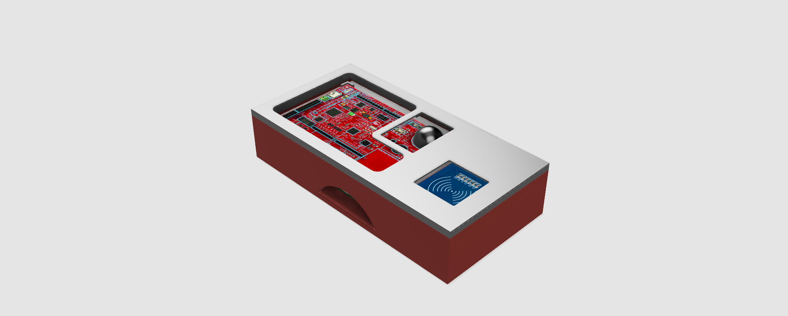
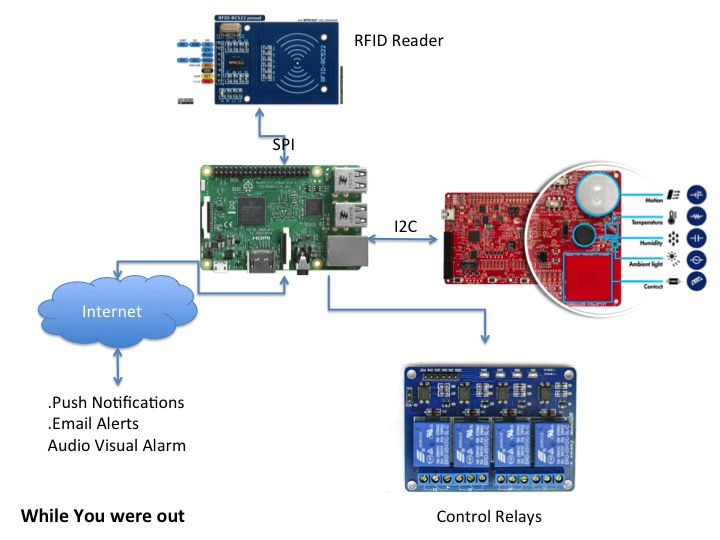

# Project: While You Were Out

This project is my entry for the Hackster.io Design Challenge For PSOC Analog CoProcessor and Smart Spaces. The ideas is to have a unit that is capable of sensing and control of office lights, fans and computers and can be activated using RFID tags and cards as well. It can also be remotely accessed for monitoring and control of mentioned peripherals and implements the logic to control the office applicances in the absence of the user. The automation is expected to provide savings in electricity as well as the prolonged life of equipment such as computer monitor, lights and fans.





## Getting Started

Clone the repository 
```bash
master
   |
   ----Documentation (Currently Empty... Oops!)
   |
   ----Energia (Code for the MSP430G to be used with the PSOC Analog CoProcessor Board)
   |
   ----OpenHAB_Config (sitemap, items file and rules file for openhab)
   |
   ----PSOCFirmware (Cypress PSOC Creator Project)
   |
   ----Python Script (A Python code for service - MQTT, MFRC etc )
   |
   ----Reference (Everything else)
```

The system is divided into two parts in terms of software. The first part is the python script that you can run using 

```bash
sudo python coprocessor.py
```

The second part is OpenHAB and 
[Openhab Can be downloaded from here](https://openhab.org)


The 3D models can be donwloaded from Pinshape [HERE](https://pinshape.com/items/32437-3d-printed-psoc-while-you-were-out)

Wire em up. See my [Youtube channel](https://youtube.com/c/InderpreetSingh) for more videos.

## Software used
- [Cypress PSOC Creator](http://www.cypress.com/products/psoc-creator-integrated-design-environment-ide)
-[Raspberry Pi Image](https://www.raspberrypi.org/downloads/raspbian/)
-[OpenHAB](https://openhab.org)

## TODO
- Write setup script for the python service

## License

This project is licensed under the GPLv2 license - see the [LICENSE.md](LICENSE.md) for details

-----> http://ip-v1.blogspot.com

Designed by Inderpreet Singh(inderpreet.github.io)

This software may be distributed and modified under the terms of the GNU
General Public License version 2 (GPL2) as published by the Free Software
Foundation and appearing in the file LICENSE.TXT included in the packaging of
this file. Please note that GPL2 Section 2[b] requires that all works based
on this software must also be made publicly available under the terms of
the GPL2 ("Copyleft").

We put a lot of time and effort into our project and hence this copyright 
notice ensures that people contribute as well as each contribution is 
acknowledged. Please retain this original notice and if you make changes
please document them below along with your details.

The latest copy of this project/library can be found at: 
https://github.com/inderpreet/
